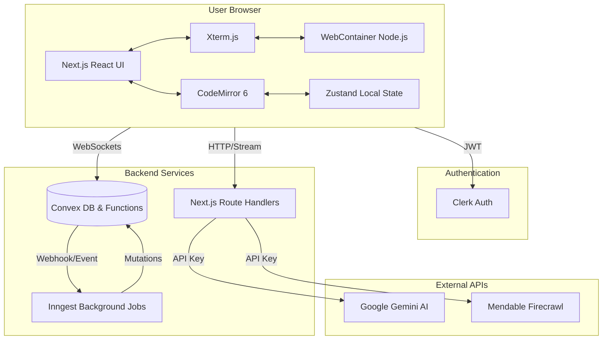
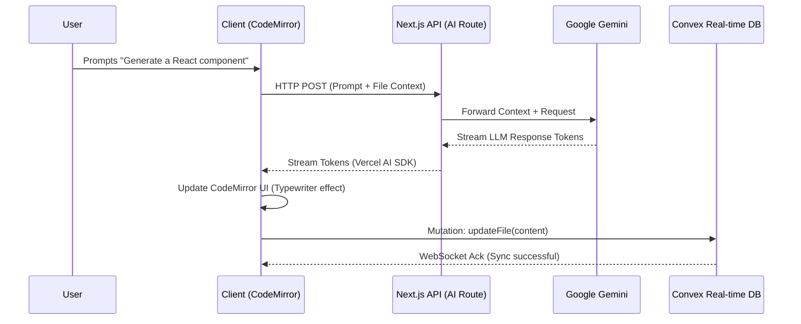
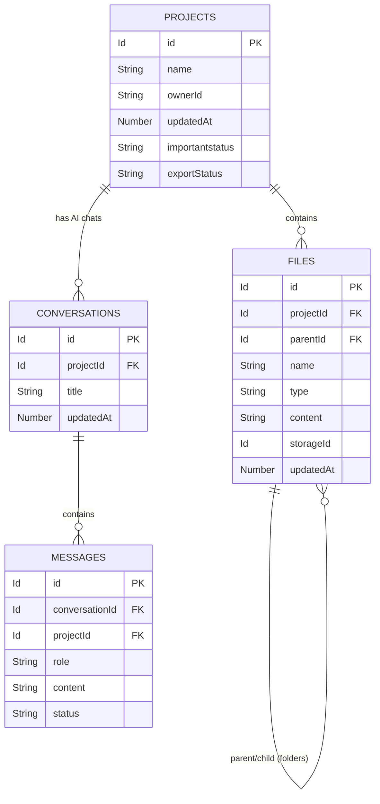

# Jinn (In-Browser IDE)

## 1. Project Overview & Core Features

This project is a state-of-the-art, entirely in-browser Integrated Development Environment (IDE) that marries robust real-time synchronization with advanced AI-driven workflows. It aims to solve the latency, infrastructure cost, and complexity of traditional cloud-based development environments by shifting execution directly into the user's browser while maintaining a persistent, real-time reactive backend.

### Core Features
- **In-Browser Compute Engine**: Utilizes the WebContainers API to run a full Node.js toolchain directly within the browser tab. No remote VMs or Docker containers are spun up per user, resulting in zero-latency startup and offline-capable execution.
- **Real-Time Reactive File System**: Backed by Convex, every file change, terminal output, and project configuration is instantly synced across all connected clients via WebSockets.
- **AI Context & Code Generation**: Deep integration with the Vercel AI SDK and Google's Gemini models. The AI assistant can read the workspace context, crawl external documentation using Mendable Firecrawl, and stream code modifications directly into the editor.
- **Advanced Editor Interface**: Built on top of CodeMirror 6 and Xterm.js, providing rich syntax highlighting, multi-language support (JS, Python, HTML, CSS, Markdown), minimaps, and full terminal emulation.
- **Asynchronous Background Workflows**: Leverages Inngest to orchestrate long-running processes (e.g., repository imports, project exports, complex AI analysis) without blocking the main event loop or requiring persistent server infrastructure.

---

## 2. System Architecture & High-Level Design (HLD)

The architecture is designed around a **Thick Client / Serverless Reactive Backend** paradigm. 

### Separation of Concerns
1. **Client Layer (The IDE)**:
   - **Next.js (React 19)**: Orchestrates the UI using the App Router.
   - **Zustand**: Manages local, ephemeral state (e.g., UI panels, active tabs, theme).
   - **Execution Context**: WebContainer instances and CodeMirror instances are strictly client-side to leverage browser resources.
2. **Server Layer (Next.js Edge & Node)**:
   - **Server Components**: Used for initial HTML streaming and SEO-friendly rendering of static project dashboards.
   - **Route Handlers / Actions**: Securely proxy requests to the LLMs (Gemini) using the AI SDK to prevent exposing API keys to the client.
3. **Database & Real-Time Sync (Convex)**:
   - Acts as the single source of truth for persistent state (Files, Projects, Conversations).
   - Automatically pushes diffs to subscribed clients rather than relying on client polling.
4. **Asynchronous Orchestration (Inngest)**:
   - Serverless event-driven queues handle heavy lifting outside of the standard request-response cycle, integrating natively with Next.js API routes.

---

## 3. Visual Data Pipelines

### 3.1. System Architecture



### 3.2. Request/Response Lifecycle (AI Code Generation)



### 3.3. Database Schema Relationships



---

## 4. Architecture Tradeoffs & Engineering Decisions

### WebContainers vs. Cloud Virtual Machines (e.g., Firecracker microVMs)
- **Decision**: WebContainers were chosen to run the Node.js environment entirely in the browser.
- **Pros**: Drastically reduces server infrastructure costs to $0 for compute. Provides the user with zero-latency terminal interactions. Works offline once the container boots.
- **Cons**: Native C++ Node modules or other languages (Rust, Go) cannot be run easily unless compiled to WebAssembly. The browser limits the amount of memory and disk space available.
- **Mitigation**: Offload unsupported heavy builds to Inngest background jobs or CI/CD pipelines.

### Convex vs. Traditional Relational DB (PostgreSQL)
- **Decision**: Convex was chosen for the persistence layer.
- **Pros**: Provides automatic WebSocket reactivity out of the box. No need to manage Redis/PubSub for real-time collaboration. Serverless functions are co-located with the data.
- **Cons**: Proprietary NoSQL-like model; complex relational queries (e.g., deeply nested joins) require multiple client-side or server-side round trips. Vendor lock-in.
- **Mitigation**: Data schema is kept heavily denormalized where appropriate, using indexed queries (`by_project`, `by_parent`) to optimize reads.

### Vercel AI SDK vs. Custom Streaming Implementations
- **Decision**: Standardizing on the Vercel AI SDK (`ai` package).
- **Pros**: Abstracted streaming protocol (`React Server Components` support, `useChat`, `useCompletion`). Makes swapping LLM providers (e.g., from Gemini to Claude) trivial.
- **Cons**: Slight abstraction overhead; custom multi-modal prompt formatting can be rigid.

---

## 5. Scalability & Performance Metrics

This architecture is uniquely positioned to handle massive user bases efficiently due to the distributed nature of its compute model.

- **Compute Scalability**: Because the compilation, execution, and language server protocols (LSP) run client-side in WebContainers, scaling to 100,000 concurrent users requires exactly the same backend compute resources as 10 users.
- **Database Scalability**: Convex handles WebSocket connection pooling and caching at the edge. Because queries are reactive, Convex tracks dependencies internally and only pushes diffs down the wire when specific rows change, drastically reducing unnecessary database polling.
- **AI API Bottlenecks**: The primary bottleneck is the LLM API rate limits (Google Gemini). Mitigated by implementing Inngest to queue and throttle background AI tasks, ensuring we do not exceed token-per-minute (TPM) limits.
- **Edge Caching**: Next.js App Router aggressively caches static assets. Sentry is integrated via Edge configurations to monitor TTFB (Time to First Byte) and Client Web Vitals without blocking the main thread.

---

## 6. Comprehensive Tech Stack

### Frontend & UI
- **Framework**: Next.js 16 (React 19, App Router)
- **Styling**: Tailwind CSS v4, PostCSS, `class-variance-authority`, `clsx`, `tailwind-merge`
- **Components**: Radix UI (Primitives), `lucide-react`, `react-icons`, `@react-symbols/icons`
- **State Management**: Zustand, React Hook Form, `@tanstack/react-form`
- **Animations**: Framer Motion (`motion`), `tw-animate-css`

### Editor & Execution Environment
- **Code Editor**: CodeMirror 6 (`@uiw/react-codemirror`, custom language packs, minimap, indentation markers)
- **Terminal**: Xterm.js (`@xterm/xterm`, `@xterm/addon-fit`)
- **Runtime**: WebContainers API (`@webcontainer/api`)
- **Visuals**: React Flow (`@xyflow/react`), Embla Carousel

### Backend, Database & APIs
- **Database & Sync**: Convex (Serverless reactive database)
- **Authentication**: Clerk (`@clerk/nextjs`)
- **Background Jobs**: Inngest (`inngest`)
- **Error Tracking**: Sentry (`@sentry/nextjs`)
- **AI & Web Integration**: Google Gemini (`@ai-sdk/google`), Vercel AI SDK, Mendable Firecrawl (`@mendable/firecrawl-js`), Streamdown (markdown parsing)
- **Utilities**: Date-fns, Zod, Nanoid, Ky

---

## 7. Setup, Environment, and Deployment

### Prerequisites
- Node.js >= 20.x
- npm, yarn, pnpm, or bun

### Step 1: Clone and Install
```bash
git clone <repository_url>
cd my_cursor
npm install
```

### Step 2: Environment Variables
Create a `.env.local` file in the root directory. You must supply the following keys:

```ini
# Clerk Auth
NEXT_PUBLIC_CLERK_PUBLISHABLE_KEY=pk_test_***
CLERK_SECRET_KEY=sk_test_***

# Convex
CONVEX_DEPLOYMENT=dev:***
NEXT_PUBLIC_CONVEX_URL=https://***.convex.cloud

# AI Models
GOOGLE_GEMINI_API_KEY=AIza***

# Web Crawling
FIRECRAWL_API_KEY=fc-***

# Background Jobs
INNGEST_EVENT_KEY=***
INNGEST_SIGNING_KEY=***

# Sentry (Optional for local dev)
SENTRY_AUTH_TOKEN=***
```

### Step 3: Local Development
Start the Next.js development server and the Convex dev server concurrently (if configured), or start them separately:

```bash
# Terminal 1: Start Next.js
npm run dev

# Terminal 2: Start Convex (syncs schema and functions)
npx convex dev

# Terminal 3: Start Inngest Dev Server
npx inngest-cli@latest dev
```
Open `http://localhost:3000` to view the application.

### Step 4: Deployment Pipeline
The application is designed for seamless deployment on Vercel.

1. **Push to GitHub**: Connect your repository to Vercel.
2. **Configure Vercel Environment Variables**: Add all production keys from `.env.local`.
3. **Convex Deployment**: Run `npx convex deploy` to push your schema and functions to the Convex production environment.
4. **Build Process**: Vercel automatically runs `npm run build` which invokes the Next.js compilation, validating ESLint and TypeScript checks. Sentry automatically uploads source maps for production error tracking via the configured plugin.
